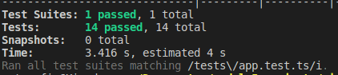
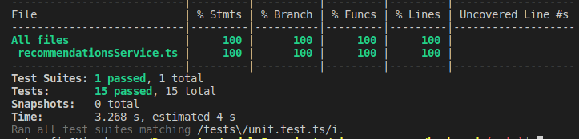
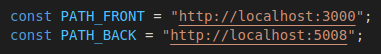
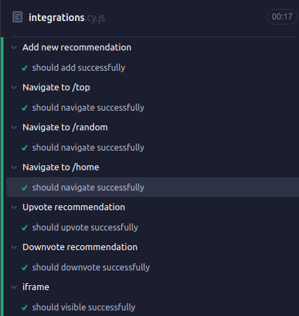

<!-- PROJECT LOGO -->
<br />
<div align="center">
  <a href="https://github.com/kirodoras/tests-sing-me-a-song">
    
  </a>

<!-- Link to src -->
  <h3 align="center">Sing me a song</h3>
  <p>
    E2E test | Integrantion test | Unit test 
    <br />
    <a href="https://github.com/kirodoras/tests-sing-me-a-song/tree/main/back-end">
    <strong>Browse Back-end code</strong></a>
    <br />
    <a href="https://github.com/kirodoras/tests-sing-me-a-song/tree/main/front-end">
    <strong>Browse Front-end code</strong></a>
</div>

<!-- Built With -->
<div align="center">
  <h3>Built With</h3>
  
  
   
  
  
  
    
  
  
</div>

<!-- Table of Contents -->
# Table of Contents

- [Description](#description)
- [Getting Started Back end](#getting-started-back-end)
- [Running Integration test](#running-integration-test)
- [Running Unit test](#running-unit-test)
- [Getting Started Front end](#getting-started-front-end)
- [Contact](#contact)

<!-- Description -->
# Description

Sing me a song, is an application for anonymous music me. The more people enjoy a chance, the more likely it is to be recommended to others.
The purpose of this project is precisely to do unit, integration and e2e tests.

<!-- Getting Started Back end-->

# Getting Started Back end

This Api can be used in two different ways: by cloning the project or by using your preferred client, such as [Insomnia](https://insomnia.rest/) or [Postman](https://www.getpostman.com/).

First of all configure an `.env` file following the `.env.example`

To clone the project, run the following command:

```git
git clone https://github.com/kirodoras/tests-sing-me-a-song.git
```

Then, navigate to the project folder and run the following command:

to navigate to the back-end folder

```git
cd back-end
```

to install dependencies:
```git
npm i -y
```
to migrate the database:
```git
npm run migrate
```
Finally, start the server:

```git
npm run dev
```

You can now access the API's endpoints by navigating to `http://localhost:5008/`
<!-- Back end Tests -->
# Running Integration test
After following the [Getting Started Back end](#getting-started-back-end) steps, follow the commands:

First of all configure an `.env.test` file

to migrate the test database:
```git
npm run test:migrate
```
Finally, run the tests:
```git
npm run test
```
Result:
<div align="center">

</div>

# Running Unit test
After following the [Getting Started Back end](#getting-started-back-end) steps, follow the commands:

First of all configure an `.env.test` file

Run the script:
```git
npm run test:unit
```
Result:
<div align="center">

</div>
<!-- Getting Started Front end-->

# Getting Started Front end

First of all configure an `.env` file following the `.env.example`

To clone the project, run the following command:

```git
git clone https://github.com/kirodoras/tests-sing-me-a-song.git
```

Then, navigate to the project folder and run the following command:

to navigate to the front-end folder

```git
cd front-end 
```

to install dependencies:
```git
npm i -y
```
Finally, start the app:

```git
npm start
```

# Running E2E test
After following the [Getting Started Back end](#getting-started-back-end) and [Getting Started Front end](#getting-started-front-end) steps, follow the commands:

Run back-end server with test database:
```git
cd back-end 
```
```git
npm run test:migrate
```
```git
npm run test:dev
```
Run front-end app:
```git
cd front-end 
```
```git
npm start
```

If necessary change the `PATH_FRONT` and `PATH_BACK` variables in the `integrations.cy.js` file depending on the ports your server is running on.
<div align="center">

</div>

Finally, run the script:
```git
cd front-end 
```
```git
npm run cy:open
```
Result:
<div align="center">

</div>

<!-- Contact -->
# Contact

[![LinkedIn][linkedin-shield]][linkedin-url]

<!-- MARKDOWN LINKS & IMAGES -->

[linkedin-shield]: https://img.shields.io/badge/-LinkedIn-black.svg?style=for-the-badge&logo=linkedin&colorB=blue
[linkedin-url]: https://www.linkedin.com/in/mateus-figueiredo-pereira/
